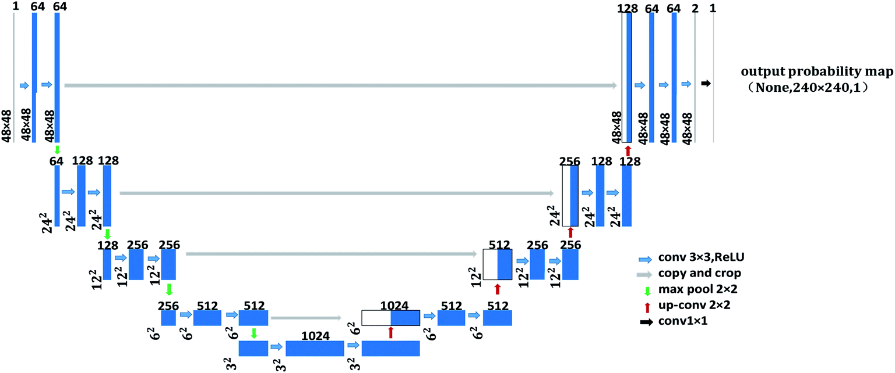
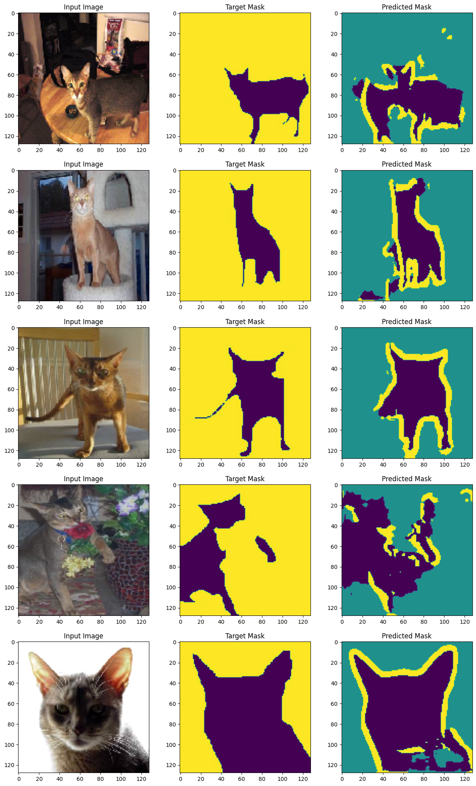
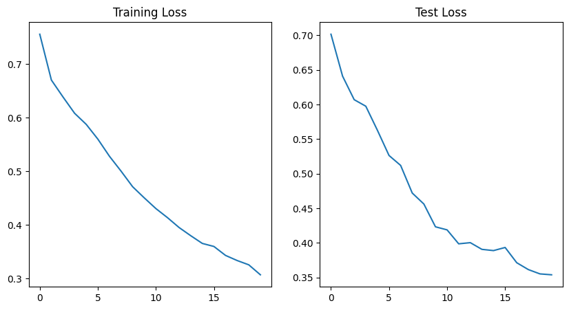
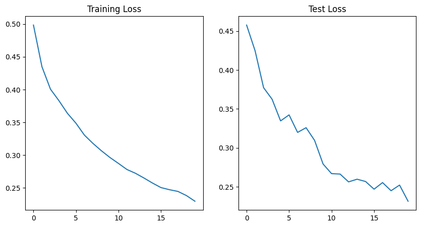
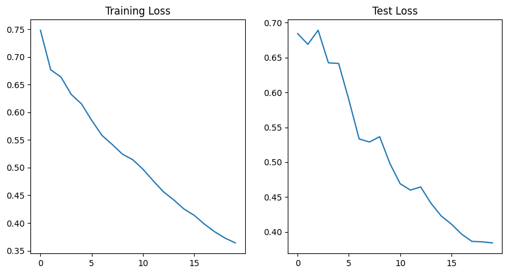
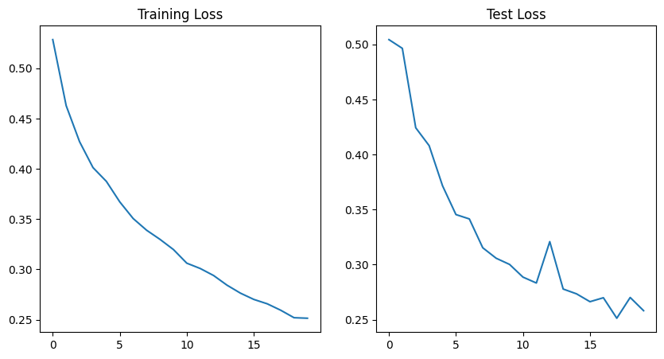
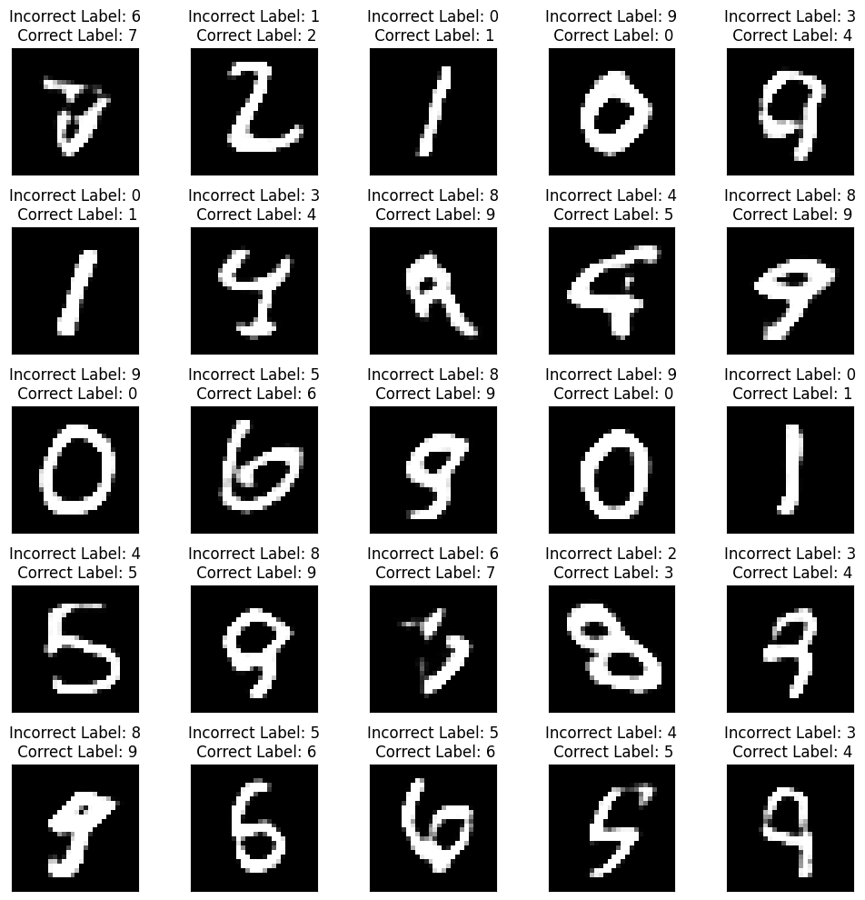
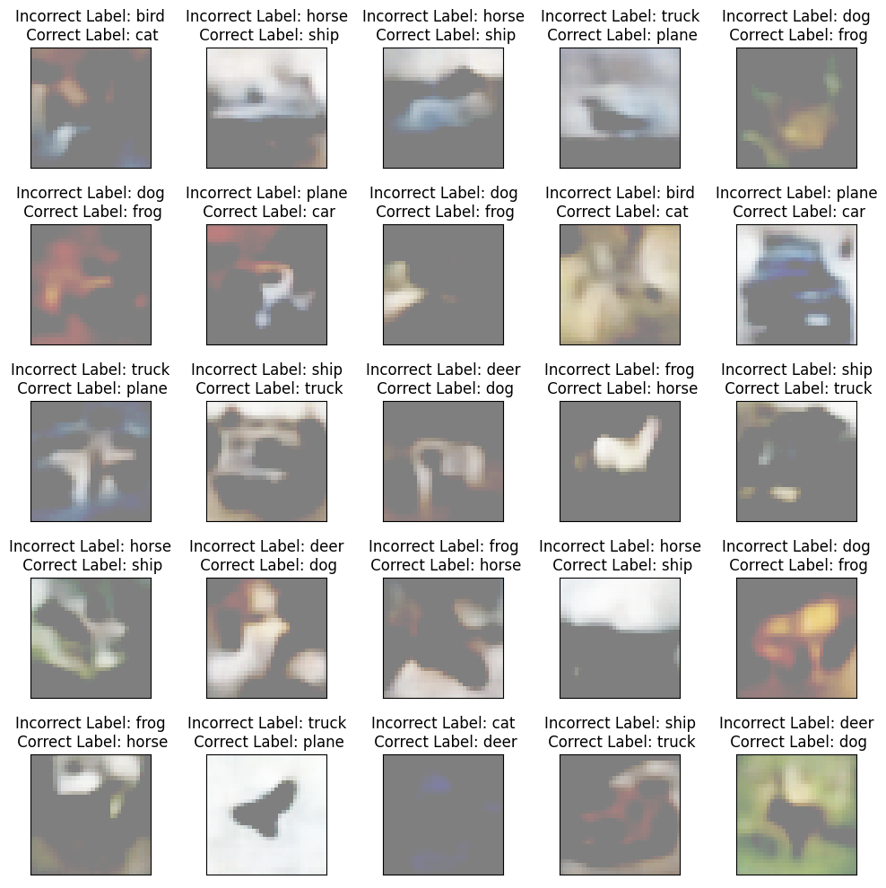

# ERA2-Session21-UNET
# UNet and Variational AutoEncoder

## UNet

- UNet architecture has 3 main parts:

  - Encoder
  - Bottleneck Layer
  - Decoder

- The encoder block contains multiple convolutional layers which embed the input data

- Bottleneck layer is a compressed low dimensional representation of the input data

- Decoder block contains upsampling/transpose layers to reconstruct the data or generate output mask

- UNet is mostly used for segmentation problems. In this case, it is used to generate mask for the pets in the input data

- UNet Model is trained on OxfordPets Dataset

- It contains images of pets and their labels (mask)

- On training, model learned to predict the mask output for the input image

  

- The model was trained using 4 different methods:

| Method                                                       | Training Logs               |
| ------------------------------------------------------------ | --------------------------- |
| **Max Pooling [Encoder]  + Transpose [Decoder] + Cross Entropy Loss** |  |
| **Max Pooling [Encoder]  + Transpose [Decoder] + Dice Loss** |  |
| **Strided Convolution [Encoder] + Transpose [Decoder] + Cross Entropy Loss** |  |
| **Strided Convolution [Encoder]  + Upsampling [Decoder]  + Dice Loss** |  |
---

## Variational AutoEncoder on MNIST

- AutoEncoders are a type of network architecture with a goal to learn a compressed representation (encoding) of input data
- The encoder block of the AutoEncoder outpus encoding vector
- In case of Variational AutoEncoders, instead of encoding vector, the encoder block will outputs two block which are the mean($\mu$) and standard deviation($\sigma$)
- The decoder performs the sampling to generate the output 

- Model is trained on MNIST dataset to regenerate the input image
- Label data is added to a separate channel and passed as an input to the model
- During training, correct label data is passed to the model
- Post training, incorrect labels are passed to the model and the generated output is shown below

## Variational AutoEncoder on CIFAR10

- The process that is used for MNIST is replicated on the CIFAR10 dataset
- The output of model when incorrect label is passed to the model is shown below

